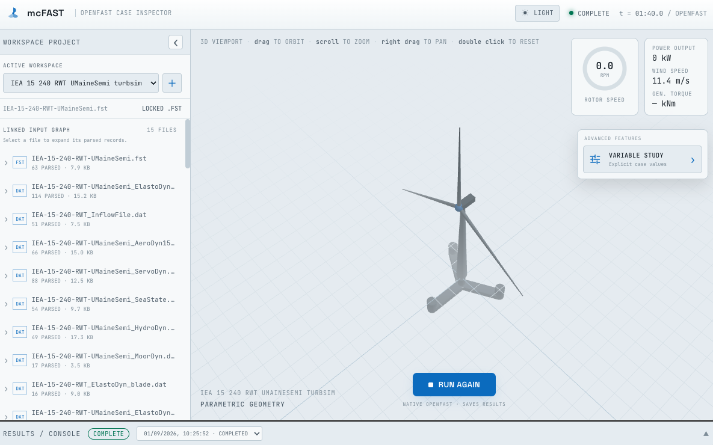

# mcFAST

mcFAST is a local, browser-based workbench for OpenFAST input decks. It walks
the references from a primary `.fst` file, presents scalar inputs as editable
records, preserves the original text format on save, and renders a parametric
Three.js turbine/platform view from values in the model.

## Quick start (macOS and Linux)

Install [uv](https://docs.astral.sh/uv/) and Node.js 20.19 or newer, then run:

```bash
uv sync --extra dev
uv run python scripts/fetch_iea15mw.py
uv run python scripts/fetch_iea22mw.py
cd web && npm install && npm run build && cd ..
uv run mcfast
```



Open <http://127.0.0.1:8000>. The model fetchers extract only the OpenFAST
subtrees from pinned official releases. The IEA Wind 15 MW fetcher uses v1.1.17
and includes the VolturnUS-S/UMaineSemi input deck. The IEA Wind 22 MW fetcher
uses v1.1.0 and includes both monopile and semisubmersible input decks from the
[official model repository](https://github.com/IEAWindSystems/IEA-22-280-RWT).
Both commands are safe to rerun; pass `--force` to replace an existing download.

For frontend development, run the API and Vite separately:

```bash
uv run mcfast --reload
cd web && npm run dev
```

Vite proxies `/api` to the Python process during development. For a production
build, the Python app serves `web/dist` directly.

## OpenFAST versus `openfast_io`

The uv environment installs the official `openfast_io` Python package from
PyPI. It reads and writes OpenFAST data, but it is **not** the native simulation
executable. `uv` cannot install Conda packages. The downloaded IEA 15 MW v1.1.17
deck targets OpenFAST 4.1, so use the compatible OpenFAST 4.2.1 Conda package
instead of the current Homebrew 5.x release:

```bash
# Creates an isolated native executable environment inside the project.
conda create --yes --prefix .openfast/conda-4.2.1 \
  --channel conda-forge --override-channels openfast=4.2.1

# Install the model's matching ROSCO controller without its optional Python UI stack.
conda install --yes --no-deps --prefix .openfast/conda-4.2.1 \
  --channel conda-forge --override-channels rosco=2.10.1
conda install --yes --prefix .openfast/conda-4.2.1 \
  --channel conda-forge --override-channels zeromq=4.3.5

# Expose that executable to the uv virtual environment.
cp scripts/openfast .venv/bin/openfast
chmod +x .venv/bin/openfast
```

Then run a deck through the uv-managed command:

```bash
uv run mcfast-run models/IEA-15-240-RWT/IEA-15-240-RWT-UMaineSemi/IEA-15-240-RWT-UMaineSemi.fst
```

The launcher resolves `.openfast/conda-4.2.1/bin/openfast` relative to this
checkout. The model fetch also adds the OpenFAST 4.2 `HubIner_Teeter` field and
points ServoDyn at the native ROSCO library. Use `--dry-run` to validate the
deck and command without starting a simulation. During a real run, console
output remains live and is also saved with the generated outputs and a JSON
manifest under `results/openfast/<run-id>/`.

The same native workflow is available in the browser: select an input deck,
press **RUN OPENFAST**, and expand **RESULTS / CONSOLE**. The console is streamed
while the process runs, and every saved result is linked when it becomes
available.

## Variable-study workspaces

Open **Advanced features → Variable study** on the right side of the viewport
to prepare explicit study cases without modifying the source model. Each
variable is bound to a linked input file and an exact scalar parameter name.
Selected variables become columns in an editable case table, so numeric,
integer, Boolean, and text values can be entered directly. CSV files with
matching variable headers append their valid rows to the existing table.
Discovered TurbSim `.in` files appear alongside the linked OpenFAST inputs and
their scalar parameters can be used as study variables in the same way.

Creating the workspace copies the model's common source tree (including
ancillary blade, airfoil, wind, controller, and hydrodynamic files) under
`workspaces/<workspace-id>/project/`. Variable bindings and case rows are saved
under `workspaces/<workspace-id>/studies/`; the modal also provides a direct
JSON download.

## TurbSim wind fields

The OpenFAST 4.2.1 Conda environment also contains the native `turbsim`
executable. This repository includes a TurbSim input at
`models/IEA-15-240-RWT/IEA-15-240-RWT/Wind/IEA15MW_IEC_ETM_U50.0_Seed60362647.in`.
Generate a reproducible group of UMaineSemi normal-turbulence inputs with:

```bash
uv run python scripts/generate_turbsim_inputs.py \
  --wind-speeds 8 10 12 \
  --seeds 101 202 303 \
  --analysis-time 60
```

This creates nine `.in` files in the shared `Wind` directory without changing
the supplied template. Add `--run` to execute TurbSim immediately and generate
the nine corresponding `.bts` files. Existing inputs are protected unless
`--overwrite` is explicitly passed. The defaults generate three 10 m/s NTM
inputs with seeds 101, 202, and 303; `--help` lists the IEC class, turbulence
category, timing, naming, and output-directory controls.

`WrADFF = True` in each generated input produces a same-stem `.bts` full-field wind file.
To use it in this model, set `WindType = 3` and `FileName_BTS` to the `.bts`
path in `IEA-15-240-RWT_InflowFile.dat`. The downloaded deck currently uses
`WindType = 1`, so its default 10-second test run is steady wind.

For workspace projects, setting `WindType = 3` also exposes a TurbSim section
under the parsed InflowWind file. Selecting an imported `.in` makes its
same-stem `.bts` the managed wind field. **Run OpenFAST** generates that output
only when it is missing or older than the `.in`; otherwise the existing wind
field is reused. If `FileName_BTS` is edited to another workspace `.bts`, the
workspace switches to external mode and runs OpenFAST without invoking TurbSim.

## API

- `GET /api/sources` discovers primary `.fst` inputs under `models/`.
- `POST /api/workspaces` imports an isolated workspace from a local `.fst` deck.
- `GET /api/workspaces/{workspace-id}/model` resolves linked files and derived geometry.
- `GET`/`PUT /api/workspaces/{workspace-id}/file?path=…` reads or losslessly updates scalar parameters.
- `GET /api/workspaces/{workspace-id}/wind` reports TurbSim candidates, mode, and output freshness.
- `PUT /api/workspaces/{workspace-id}/wind` selects a managed `.in` and updates `FileName_BTS`.
- `POST /api/workspaces/{workspace-id}/runs` starts the TurbSim/OpenFAST pipeline in the background.
- `GET /api/workspaces/{workspace-id}/runs/{run-id}?offset=…` returns incremental console output and state.

The conservative parser does not rewrite tables or output-channel lists. That
keeps round trips safe while table-aware editing can be added format by format.

## Verification

```bash
uv run pytest
cd web && npm run build
```

The integration test uses the downloaded official IEA 15 MW VolturnUS-S deck;
without it, only that test is skipped.
